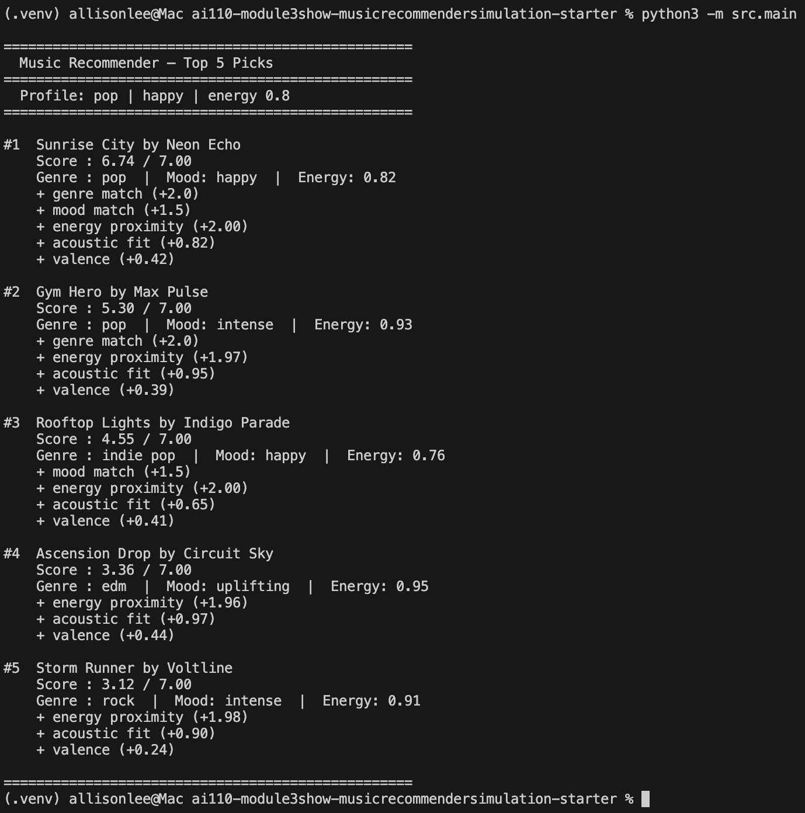
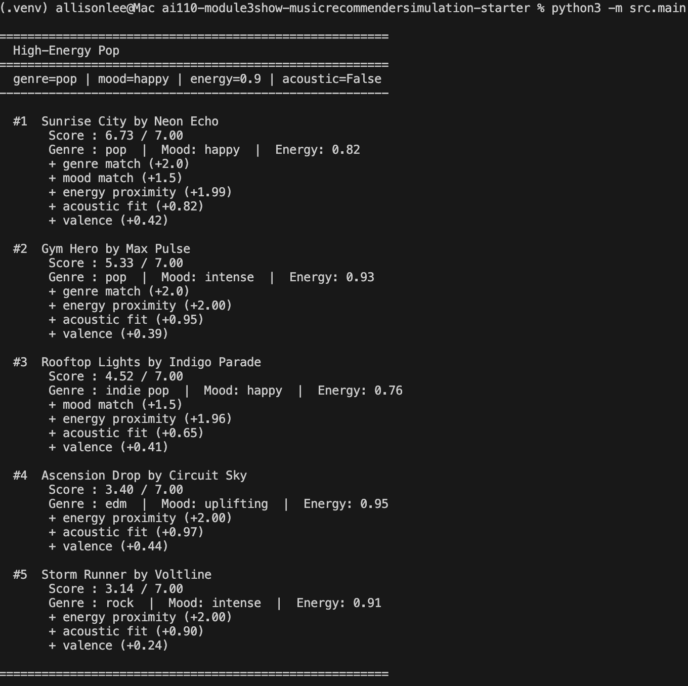
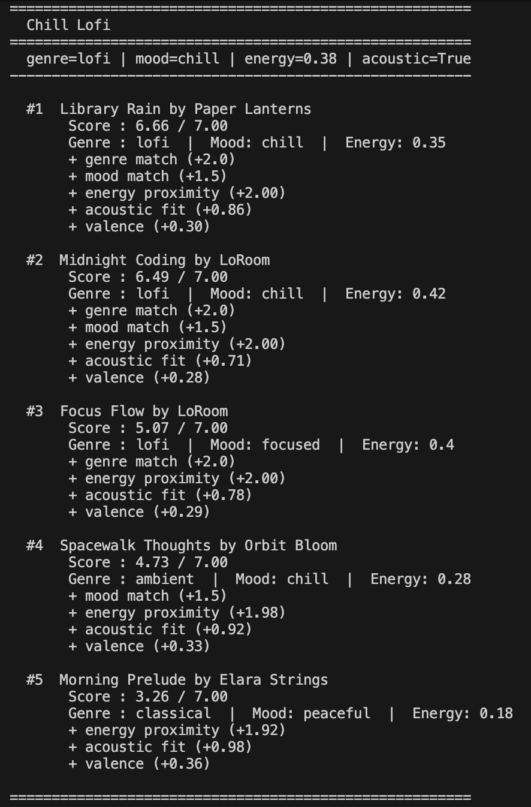
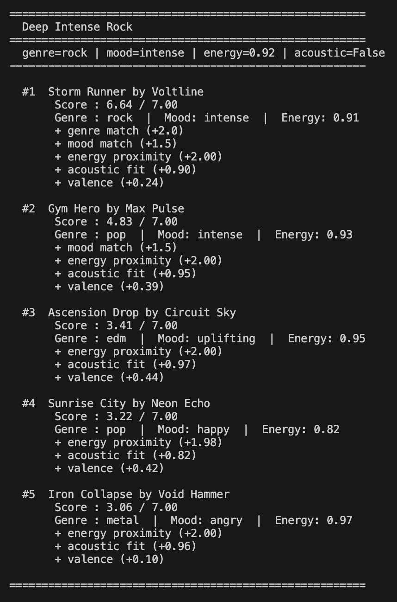
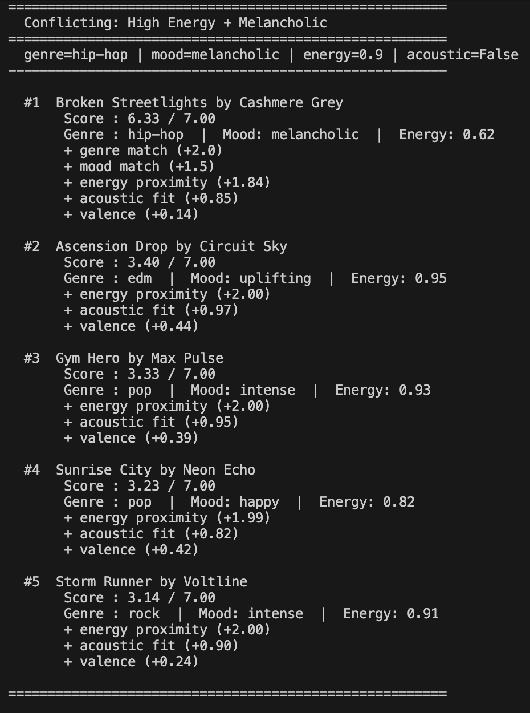
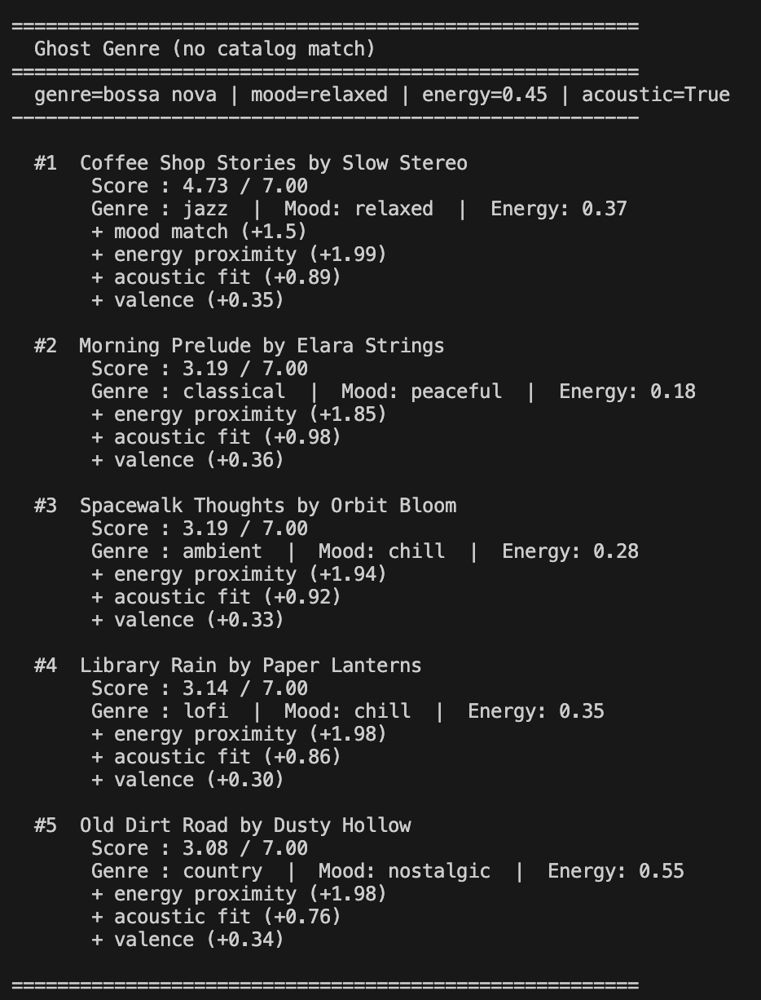
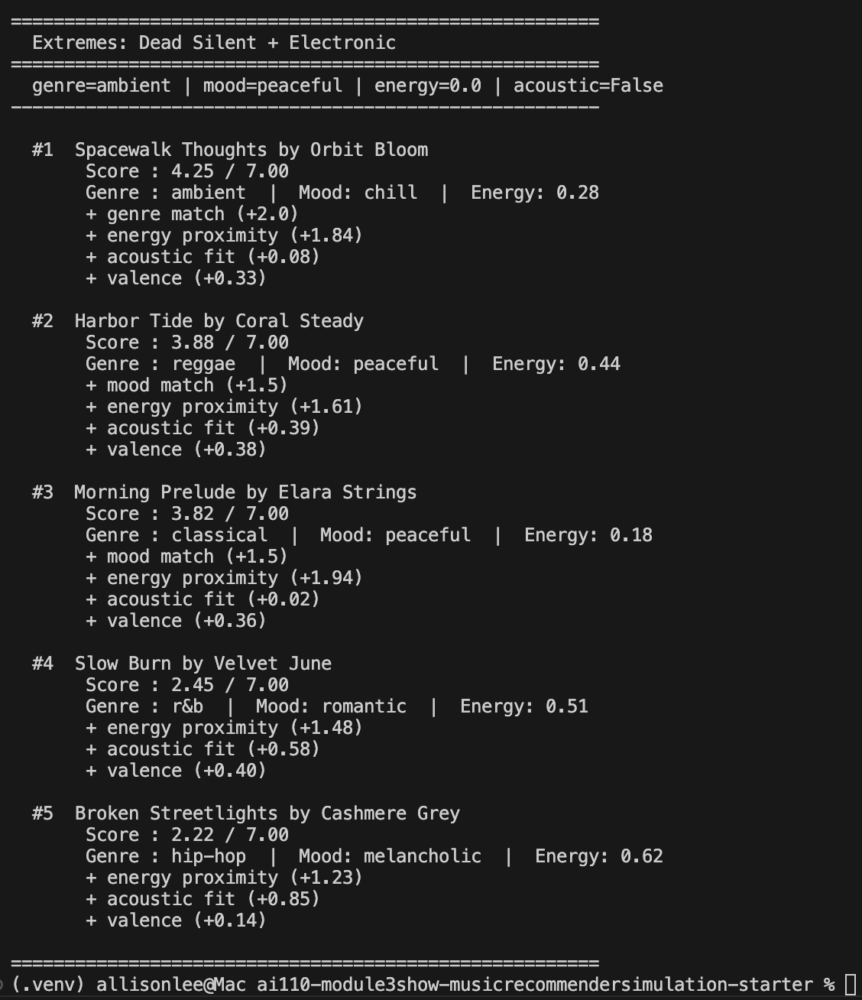

# 🎵 Music Recommender Simulation

## Project Summary

This project is a content-based music recommender built in Python. It loads a catalog of 18 songs from a CSV file, takes a user taste profile as input, scores every song against that profile using a weighted formula, and returns the top 5 matches with a plain-language explanation for each result. The whole thing runs in the terminal with `python3 -m src.main`.

---

## How The System Works

Unlike real-world recommenders that learn from listening behavior, this system scores songs by directly comparing audio features to what the user says they want. Every recommendation is fully explainable, traceable to specific feature matches, but the system cannot discover taste the user hasn't already described.

The catalog contains 18 songs across 15 genres and 13 moods, loaded from `data/songs.csv`. The user profile stores four fields: `genre`, `mood`, `target_energy`, and `likes_acoustic`. The default "Late Night Focus" profile is: lofi, focused, energy 0.40, acoustic preferred.

Each song is scored on a 0.0–8.0 point scale by summing five sub-scores: +1.0 for a genre match, +1.5 for a mood match, up to +4.0 for energy proximity via `4.0 × (1 - (song.energy - target)²)`, up to +1.0 for acoustic fit, and up to +0.5 for valence as a tiebreaker. Songs are then sorted by score and the top five returned.

Energy is weighted highest because it is continuous and scores every song, not just the lucky few that match a category. Mood sits at +1.5 since it captures use-case intent. Genre is kept at +1.0 because with only 18 songs and 15 genres, a binary genre match would dominate rankings in a way that felt unfair to most users.

A few biases are expected. The genre match gives a structural head start to the one or two songs that happen to match, which numeric features alone cannot overcome. Songs with no genre or mood match cluster in a narrow score band where ordering is semi-arbitrary. The valence tiebreaker silently favors brighter songs the user never asked for. And the boolean `likes_acoustic` is too blunt, as it cannot express a preference for moderately acoustic over fully acoustic.

----
 
----
 
 
 
 
 
 
---

## Getting Started

### Setup

1. Create a virtual environment (optional but recommended):

   ```bash
   python -m venv .venv
   source .venv/bin/activate      # Mac or Linux
   .venv\Scripts\activate         # Windows
   ```

2. Install dependencies:

   ```bash
   pip install -r requirements.txt
   ```

3. Run the app:

   ```bash
   python3 -m src.main
   ```

### Running Tests

```bash
pytest
```

You can add more tests in `tests/test_recommender.py`.

---

## Experiments You Tried

**Weight shift — doubled energy, halved genre:**
Changed genre from +2.0 to +1.0 and energy from a 2× to 4× multiplier. The mid-catalog rankings became more meaningful, as songs separated further on numeric grounds rather than clustering. The biggest visible change was that Rooftop Lights (indie pop, happy) overtook Gym Hero (pop, intense) in the High-Energy Pop profile because its mood match plus close energy outweighed Gym Hero's genre advantage once genre was worth less.

**Adversarial profiles:**
Three edge-case profiles were run to stress-test the system. These were a conflicting profile (high energy + melancholic mood), a ghost genre profile (bossa nova, which isn't in the catalog), and an extreme profile (target energy 0.0, no acoustic preference). The conflicting profile showed that two binary matches together can override a large numeric mismatch. The ghost genre profile revealed that the system returns a confident-looking list even when the user's genre was completely ignored.

**Six distinct user profiles total:**
High-Energy Pop, Chill Lofi, Deep Intense Rock, Conflicting, Ghost Genre, and Extremes. Each produced a different #1 song, no single track dominated across profiles, which confirms the genre weight isn't too strong.

---

## Limitations and Risks

- **Catalog is too small and unevenly distributed.** 18 songs across 15 genres means most genres have only one song. Lofi listeners get 3 candidates; metal and reggae fans get 1. Rankings for underrepresented genres are mostly arbitrary.
- **No warning when preferences can't be matched.** If a user asks for "bossa nova" and the catalog has none, the system silently falls back to numeric scoring and returns a confident-looking list with no indication their genre was ignored.
- **Binary acoustic preference.** `likes_acoustic` is a true/false flag, so a user who just wants "a bit acoustic" gets the same treatment as someone who only listens to unplugged guitar music.
- **Valence tiebreaker is unanchored.** Brighter songs always score slightly higher, even for users who prefer dark or melancholic music.
- **No learning from behavior.** Every run starts fresh. The system has no memory of what a user skipped or replayed, so it can't improve its recommendations over time.

---

## Reflection

[**Model Card**](model_card.md)

Building this made it clear how quickly simple arithmetic can start to feel like intelligence. The scoring function is only about 40 lines, but the output: ranked songs with explanations, looks and feels like a real recommendation. The gap between "arithmetic" and "taste" is smaller than expected, which is worth being skeptical of. The adversarial profiles were the most valuable part: running a conflicting profile (high energy + melancholic mood) exposed that two binary matches together can override a significant numeric mismatch, making the system more confident than it should be. Bias in a recommender sometimes looks like the system being quietly wrong, and the only way to catch it is to try strange cases.

---